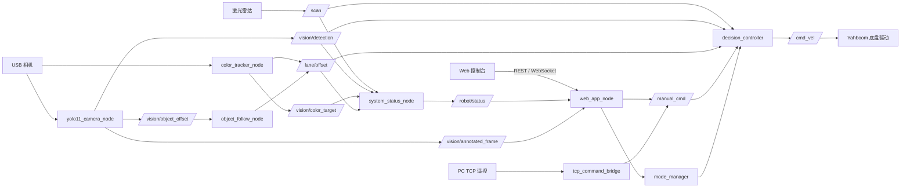

# ROS2 智能小车感知与控制系统

本项目面向 Yahboom ROSMASTER X3 四轮麦克纳姆智能小车，基于 ROS2 Humble 构建感知、决策、安全控制与 Web 运维控制台。当前代码已经在 Jetson 实车上部署，完成了底盘接入、激光雷达安全控制、YOLO11 视觉识别、HSV 颜色追踪、人物目标跟随、网页遥控和实时状态展示等功能。

本文档记录的是当前仓库与实车已经具备的能力，同时明确列出测试证据、能力边界和未完成工作，可作为后续项目报告中“系统设计”“功能实现”“测试分析”和“总结展望”等章节的事实依据。

## 1. 当前完成情况

| 模块 | 当前状态 | 说明 |
| --- | --- | --- |
| ROS2 底盘接入 | 已实现并实车运行 | 启动 Yahboom `Mcnamu_driver_X3`，接收 `/cmd_vel` 控制底盘 |
| 模式管理与急停 | 已实现并测试 | 支持 7 种模式；急停拥有最高控制优先级 |
| 网页手动遥控 | 已实现并测试 | 浏览器发送方向命令，非 `manual` 模式下拒绝移动命令 |
| 激光雷达显示与安全停车 | 已实现并实车测试 | 显示 `/scan` 点云和前方距离，支持近障停车、减速和雷达超时停车 |
| YOLO11 通用目标识别 | 已实现并实车运行 | 使用 `yolo11s.pt`，发布识别结果和标注视频帧 |
| 人物目标跟随 | 已实现，完成感知链路测试 | 只选择 `person`，支持目标锁定、短时丢失保持和偏移控制；尚未完成空旷场地连续轨迹测试 |
| HSV 颜色追踪 | 已实现并实车运行 | 支持红、绿、蓝、黄预设和自定义 HSV 范围 |
| 颜色配置保存 | 已实现并测试 | 保存在浏览器本地，刷新后重新下发到 ROS；不是 Jetson 端永久配置文件 |
| Web 状态与视频 | 已实现并测试 | 提供 REST、WebSocket、MJPEG/标注帧转发和雷达可视化 |
| Docker 工程文件 | 已提供 | 已有 Dockerfile 和运行脚本，但未完成当前版本的完整实车容器验收 |
| SLAM、建图和 Nav2 导航 | 未完成 | 已保留模式和厂商参考启动项，当前决策节点不会在这些模式下直接输出运动速度 |
| 机械臂抓取 | 未完成 | 不在当前软件闭环中 |

## 2. 项目边界与自研部分

Yahboom 官方工作空间提供底盘串口驱动、激光雷达驱动和部分 SLAM、导航、相机示例。本项目在这些底层驱动之上开发 ROS2 决策控制包和 Web 控制系统，不将厂商驱动描述为完全自研。

当前主要自研内容包括：

- 多模式管理、急停、命令超时和速度比例控制；
- 雷达前方扇区计算、点云简化、坐标旋转和安全优先级控制；
- YOLO11 推理节点、交通灯颜色辅助判定和安全命令保持；
- 只跟随人物的目标选择与跨帧锁定逻辑；
- HSV 颜色追踪、运行时阈值配置和标注图像发布；
- ROS2 状态汇总、FastAPI 服务和 React/Vite Web 控制台；
- 摄像头所有权切换，避免网页、YOLO 和颜色追踪同时抢占 `/dev/video0`；
- Jetson 原生构建、启动和部署脚本，以及配套自动化测试。

## 3. 系统总体架构



系统的核心控制原则是“安全信号优先于运动意图”。即使视觉节点持续给出人物偏移，只要急停被触发、前方距离小于停车阈值、雷达数据超时或人物偏移失效，`decision_controller` 都会输出零速度。

## 4. 软件与硬件环境

### 4.1 已验证硬件

- Yahboom ROSMASTER X3 麦克纳姆轮底盘；
- Jetson 计算平台，远程主机名为 `yahboom`；
- SLLidar 激光雷达，实车可发布 `/scan`；
- Orbbec USB 相机，视频设备为 `/dev/video0` 和 `/dev/video1`；
- CP210x 与 CH340 USB 串口设备，分别用于雷达和底盘通信。

### 4.2 软件栈

- Ubuntu + ROS2 Humble；
- Python 3、`rclpy`、OpenCV、Ultralytics YOLO；
- FastAPI、Uvicorn；
- React 19、TypeScript、Vite；
- `pytest` 与 Node.js 内置测试框架；
- Yahboom 官方 ROS2 驱动工作空间。

## 5. 目录结构

```text
ros2-smart-car/
├─ ros2_ws/src/smart_car_decision/    # 自研 ROS2 功能包
│  ├─ config/decision.yaml            # 控制、感知和 Web 参数
│  ├─ launch/bringup_all.launch.py    # 底盘、雷达与自研节点统一启动
│  ├─ models/yolo11s.pt               # YOLO11 模型权重
│  ├─ smart_car_decision/             # Python ROS2 节点和纯逻辑模块
│  └─ web/static/                     # 兼容静态 Web 页面
├─ web-console/                       # React/Vite Web 控制台及生产构建
├─ tests/                             # Python 自动化测试
├─ scripts/                           # Jetson、Docker 构建与运行脚本
├─ ros2_command/                      # 旧版 PC TCP 遥控工具
├─ Dockerfile                         # ROS2 容器环境
└─ README.md
```

## 6. ROS2 节点与职责

统一启动文件会启动 2 个厂商进程和 9 个自研节点。

| 节点或进程 | 主要职责 | 关键输入 | 关键输出 |
| --- | --- | --- | --- |
| `Mcnamu_driver_X3` | Yahboom 底盘串口驱动 | `/cmd_vel` | 里程计、IMU 等厂商话题 |
| `sllidar_node` | 激光雷达驱动 | 雷达串口 | `/scan` |
| `mode_manager` | 模式和急停状态管理 | `/robot/mode/set`、`/robot/emergency_stop/set` | `/robot/mode`、`/robot/emergency_stop` |
| `decision_controller` | 安全仲裁和运动决策 | 雷达、视觉、手动命令、模式 | `/cmd_vel` |
| `laser_obstacle_monitor` | 输出辅助前方障碍布尔量 | `/scan` | `/obstacle/front` |
| `yolo11_camera_node` | YOLO11 推理、人物偏移和标注帧 | 相机、`/robot/mode` | `/vision/detection`、`/vision/object_offset`、`/vision/annotated_frame` |
| `color_tracker_node` | HSV 分割、颜色质心和标注帧 | 相机、颜色配置、模式 | `/vision/color_target`、`/lane/offset`、标注帧 |
| `object_follow_node` | 将有效人物偏移接入统一控制接口 | `/vision/object_offset`、模式 | `/lane/offset` |
| `system_status_node` | 汇总感知和运行状态 | 雷达、视觉、模式、速度 | `/robot/status` |
| `web_app_node` | REST、WebSocket、视频与网页服务 | `/robot/status`、标注帧 | 模式、急停、速度、颜色配置和手动命令 |
| `tcp_command_bridge` | 兼容旧 PC 遥控程序 | TCP 9999 | `/manual_cmd` |

## 7. 工作模式

| 模式 | 当前行为 |
| --- | --- |
| `stop` | 始终输出零速度，适合待机和调试 |
| `manual` | 接受网页或 TCP 手动命令；命令超过 0.7 秒未刷新则停车 |
| `auto` | 根据 YOLO 语义结果执行停车、减速或直行，同时受雷达安全层约束 |
| `color_track` | 根据颜色目标横向偏移低速前进和转向；目标偏移失效则停车 |
| `object_follow` | 只跟随 `person`，根据人物中心偏移低速前进和转向 |
| `mapping` | 当前不直接发布运动速度，避免与厂商建图控制链路争抢 `/cmd_vel` |
| `navigation` | 当前不直接发布运动速度，尚未接入完整 Nav2 目标导航闭环 |

## 8. 核心功能与算法

### 8.1 安全仲裁

控制优先级从高到低为：

1. 急停或 `stop` 模式；
2. 自动模式下雷达数据超时；
3. 前方障碍停车；
4. 前方障碍减速；
5. 手动、YOLO、颜色或人物跟随运动意图。

主要参数如下：

| 参数 | 当前值 | 作用 |
| --- | ---: | --- |
| `obstacle_stop_distance` | 0.45 m | 前方距离不大于该值时输出零速度 |
| `obstacle_slow_distance` | 0.75 m | 前方距离位于停车线之外但仍较近时降速 |
| `scan_timeout_sec` | 0.6 s | 自动、颜色追踪和人物跟随模式下，雷达超时即停车 |
| `command_timeout_sec` | 0.7 s | 手动命令超时停车 |
| `lane_timeout_sec` | 0.5 s | 颜色或人物偏移超时停车 |
| `cruise_speed` | 0.28 m/s | 自动模式基础巡航速度 |
| `slow_speed` | 0.12 m/s | 跟随或近障时的基础低速 |
| `publish_rate_hz` | 20 Hz | 决策控制输出频率 |

网页还提供 `speed_scale` 速度比例。当前下限为 15%，用于防止滑块为零时产生“按钮正常但车辆完全不响应”的误判；最终速度仍然受急停和雷达强制覆盖。

### 8.2 雷达前方距离与点云显示

实车雷达安装方向与最初代码假设相反，车头对应激光坐标约 180°。当前系统使用：

- `front_center_deg = 180°` 作为车头中心；
- `front_angle_deg = 35°` 作为左右前方扇区范围；
- 前方有效距离的 20% 低分位值作为安全距离，避免单个异常近点频繁触发急停；
- 对点云坐标旋转 180°，使 Web 雷达图中的“上方”与真实车头一致；
- 过滤 `NaN`、无穷值以及量程之外的数据，再最多抽取 96 个点用于网页显示。

例如，前方扇区包含 `[0.08, 1.00, 1.10, 1.20, 1.30] m` 时，单纯取最小值会被 0.08 m 噪声影响；采用低分位统计后会得到约 1.00 m，更接近连续障碍面的真实距离。

### 8.3 YOLO11 识别与自动控制

YOLO 节点只在 `auto` 和 `object_follow` 模式下占用相机，其他模式会释放设备。当前模型为通用 `yolo11s.pt`，置信度阈值为 0.35，推理目标频率为 10 Hz。

`auto` 模式中的类别规则包括：

- 停车标志、遮挡严重画面：停车；
- 行人、汽车、卡车、公交车、摩托车和自行车：减速；
- 交通灯：在检测框内进一步使用 HSV 比例判断红灯或绿灯；
- 未识别或无关类别：归一化为 `no_light`，不会因为偶发漏检直接反复切换到停车；
- 安全命令保持 0.8 秒，降低检测帧抖动造成的控制跳变。

### 8.4 只跟随人物的目标选择

`object_follow` 模式不会跟随汽车、动物或其他一般物体，只处理 YOLO 的 `person` 类。

目标确定过程如下：

1. 没有锁定目标时，从人物检测框中优先选择置信度较高的人；置信度相同时优先选择靠近画面中心的人；
2. 锁定后，不再每帧重新选择置信度最高的人，而是选择中心位置最接近上一帧目标的人；
3. 新检测框与原目标中心的跳变量不得超过画面宽度的 30%；
4. 目标短时丢失时不立即切换旁人，也不发布虚假偏移；
5. 丢失超过 0.8 秒后解除锁定，下一次检测才重新选择人物。

人物框中心相对画面中心的归一化偏移为：

```text
offset = (person_center_x - frame_center_x) / frame_half_width
```

偏移范围约为 `[-1, 1]`。负值表示人物在画面左侧，正值表示人物在右侧。控制器用比例控制计算角速度，同时以低速向前运动。雷达停车优先级始终高于人物偏移，因此人物在前方但障碍距离过近时，小车仍保持静止。

当前人物跟随已经实车验证到以下链路：YOLO 独占相机、标注帧约 9.6～10.2 FPS、持续发布人物偏移、`object_follow_node` 转发偏移、控制器接收偏移并在近障条件下正确输出零速度。

### 8.5 HSV 颜色追踪与配置保存

颜色追踪节点对图像执行 HSV 阈值分割，通过掩膜矩计算目标面积和质心，并发布：

- 是否找到目标；
- 目标相对画面中心的横向偏移；
- 掩膜面积；
- 当前 HSV 上下界；
- 带质心和状态文字的标注帧。

Web 控制台提供红、绿、蓝、黄预设，也允许手动输入 HSV 范围。点击“应用配置”后，配置经 `/api/color-target` 发布到 `/vision/color_config`，颜色追踪节点无需重启即可更新阈值。

颜色配置同时保存在浏览器 `localStorage` 中。页面重新打开时会先读取本地配置并重新下发到 ROS。系统还使用由颜色名称和 HSV 数值生成的稳定键判断配置是否真的变化，避免 WebSocket 每次刷新产生新对象后，把用户正在编辑的红色配置重置成绿色。

需要注意：颜色配置目前是“浏览器级保存”，不是 Jetson 端配置文件永久保存。清除浏览器数据、换一台设备或在浏览器尚未连接时重启系统，后端仍会先使用 `decision.yaml` 中的默认绿色。

### 8.6 摄像头所有权管理

`/dev/video0` 不能被多个 OpenCV 进程稳定地同时打开，因此系统按模式划分相机所有权：

- `stop`、`manual` 等非视觉模式：Web 节点可以直接读取相机预览；
- `auto`、`object_follow`：YOLO 节点占用相机并发布 `/vision/annotated_frame`；
- `color_track`：颜色追踪节点占用相机并发布同一标注帧话题；
- Web 页面在视觉模式下不再直接抢占相机，只转发视觉节点发布的 JPEG 标注帧。

这一结构解决了网页预览和 YOLO 同时打开 `/dev/video0` 导致的 `Device is busy` 问题。

## 9. Web 控制台

实车访问地址：

```text
http://192.168.1.104:8080
```

主要功能包括：

- 模式切换、急停和解除急停；
- 手动前后、平移和原地转向；
- 速度比例设置；
- YOLO/颜色标注视频显示；
- 前方距离和雷达点云显示；
- YOLO 结果、人物或颜色偏移、最后命令显示；
- HSV 颜色预设、自定义阈值和本地保存；
- 节点、相机、连接状态和原始 JSON 查看；
- WebSocket 状态更新与断线后的 HTTP/重连处理。

### 9.1 REST 接口

| 方法 | 路径 | 功能 |
| --- | --- | --- |
| GET | `/api/status` | 获取当前系统状态 |
| POST | `/api/mode` | 设置工作模式 |
| POST | `/api/command` | 发送手动控制命令 |
| POST | `/api/emergency-stop` | 设置或解除急停 |
| POST | `/api/speed` | 设置速度比例 |
| POST | `/api/color-target` | 设置 HSV 颜色配置 |
| GET | `/video_feed` | 获取 MJPEG 视频流 |

WebSocket 接口包括 `/ws/status` 和 `/ws/control`，分别用于实时状态推送和低延迟手动命令。

## 10. 构建与运行

### 10.1 Jetson 原生运行

```bash
cd ~/ros2-smart-car
bash scripts/build_jetson.sh
bash scripts/run_jetson.sh
```

`run_jetson.sh` 会加载 ROS2 Humble、本项目工作空间和 Yahboom 常见工作空间，然后启动底盘驱动、SLLidar 和全部自研节点。系统默认模式为 `stop`。

### 10.2 常用检查命令

```bash
export ROS_DOMAIN_ID=77
ros2 node list
ros2 topic list
ros2 topic echo /robot/status
ros2 topic echo /cmd_vel
ros2 topic hz /scan
ros2 topic hz /vision/annotated_frame
```

### 10.3 PC 旧版遥控工具

```bash
python ros2_command/pc.py --host 192.168.1.104 --port 9999
```

支持 `forward`、`backward`、`left`、`right`、`turn_l`、`turn_r` 和 `stop`。这些命令经 `tcp_command_bridge` 转换为 `/manual_cmd`。

### 10.4 Docker

仓库提供 `Dockerfile`、`scripts/build_jetson.sh` 和 `scripts/run_docker.sh`。容器使用 host 网络和设备映射，以便访问 ROS2 网络、相机和串口。当前建议优先使用已经完成实车验证的 Jetson 原生运行方式。

## 11. 自动化测试

### 11.1 Python 测试

当前测试命令：

```bash
PYTHONPATH=ros2_ws/src/smart_car_decision python -m pytest -q
```

最近一次本地与 Jetson 运行结果均为：

```text
37 passed
```

37 项测试覆盖以下方面：

| 测试组 | 覆盖内容 |
| --- | --- |
| 颜色配置 | HSV 数值限幅、状态存储、刷新后重新下发 |
| 控制策略 | 非法模式、停止模式、急停、手动命令超时、近障停车、识别超时、速度比例、人物偏移转向、雷达超时停车 |
| 人物锁定 | 忽略非人物类别、初次选择、检测顺序变化时保持目标、丢失超时后重新选择 |
| 雷达处理 | 无效距离过滤、点云投影、180° 前方扇区、跨 ±π 角度、低分位抗噪、空扇区、显示坐标旋转 |
| YOLO 决策 | 遮挡画面停车、未知类别归一化、安全命令短时保持 |
| Web 状态 | 非法模式拒绝、非手动模式拒绝手动命令、急停状态更新 |
| 视频流 | 标注帧新鲜度、空帧和过期帧拒绝、等待新版本、视觉模式释放网页直连相机 |
| 相机参数 | 采集 FPS、目标输出 FPS 和视觉模式相机占用规则 |
| 静态资源 | 优先加载 React/Vite 生产构建目录 |

### 11.2 前端测试与构建

前端测试命令：

```bash
node --experimental-strip-types --test --test-isolation=none \
  web-console/tests/colorPersistence.test.ts \
  web-console/tests/robotApi.test.ts \
  web-console/tests/videoState.test.ts
```

最近一次结果为：

```text
7 passed
```

覆盖内容包括：

- 颜色配置跨页面刷新保存；
- 无效本地颜色数据安全回退；
- 等价 WebSocket 颜色快照使用稳定身份键，不重置编辑中的颜色；
- 模式和速度 REST 请求体；
- WebSocket 地址随 HTTP/HTTPS 和主机变化；
- 视频加载完成状态；
- 视频加载看门狗超时状态。

生产构建命令：

```bash
cd web-console
npm run build
```

TypeScript 编译和 Vite 生产构建已通过，生成的带哈希资源已部署到 Jetson。

## 12. 实车测试记录

当前版本已经完成以下实车检查：

1. SSH 登录 Jetson，确认项目目录、ROS2 包和厂商驱动可用；
2. 确认 `/dev/ttyUSB0`、`/dev/ttyUSB1`、`/dev/video0` 和 `/dev/video1` 存在；
3. 单独启动 SLLidar，成功获取 `/scan`，雷达健康状态为 `OK`，实际更新约 7～10 Hz；
4. 启动状态节点后，`front_distance` 从原先的 `null` 修复为有效米制距离；
5. 雷达点云旋转后，Web 图中的车头方向与实车一致；
6. 调用颜色接口切换到红色，等待后续状态刷新后仍保持红色；
7. 完整启动后确认底盘、雷达和 9 个自研节点均在线；
8. `stop` 模式下实测 `/cmd_vel` 的线速度和角速度全部为 0；
9. 人物跟随模式下，YOLO 独占 `/dev/video0`，标注帧约 9.6～10.2 FPS，并成功发布人物偏移；
10. 前方距离小于 0.45 m 时，即使人物偏移持续有效，`/cmd_vel` 仍保持全零；
11. Web 首页和 `/api/status` 返回 HTTP 200，生产资源已更新为最新哈希文件；
12. Jetson 端重新编译成功，远端 Python 测试为 37 项通过。

这些结果证明了“传感器输入—感知节点—决策节点—安全仲裁—状态展示”链路能够在实车上运行。需要强调的是，人物跟随的运动部分因为测试时前方存在近障，安全层正确阻止了车辆前进，因此尚不能把“长距离连续跟随效果”写成已完成验收。

## 13. 已知限制与未完成工作

### 13.1 需要优先完成

1. **人物连续运动跟随测试**：需要在空旷、无台阶场地测试直行、转向、目标横穿、短时遮挡、多人交叉和目标离开等工况，并记录轨迹、偏移和停车距离。
2. **辅助障碍节点方向统一**：核心 `decision_controller` 和状态显示已经使用 180° 车头方向，但 `laser_obstacle_monitor` 仍保留较早的零度中心简化逻辑。该节点目前不是核心运动决策的安全来源，后续仍应统一参数和算法。
3. **颜色配置后端持久化**：当前配置保存在浏览器本地。后续可在 Jetson 保存 YAML/JSON，使所有终端和系统重启前后共享同一配置。
4. **系统化 Web 视觉回归**：已完成前端单元测试、构建和 HTTP 检查，但还缺少多浏览器、手机尺寸、弱网、断线重连和长时间运行的完整自动化 UI 测试。

### 13.2 算法能力限制

- 人物锁定使用检测框中心连续性启发式算法，不是 ByteTrack、DeepSORT 或带 ReID 的多目标跟踪器；多人长时间交叉或完全遮挡后仍可能换人；
- YOLO 使用通用 `yolo11s.pt`，尚未针对本项目场景制作数据集、训练模型或给出 mAP、Precision、Recall 等量化指标；
- 交通灯判断依赖检测框内 HSV 比例，复杂光照、反光和远距离小目标下需要进一步标定；
- 雷达距离参数根据当前安装方向和现场测试设置，更换安装方向后必须重新校准 `front_center_deg`；
- 当前跟随控制主要是横向比例控制，没有目标距离视觉估计、速度平滑、加速度约束和轨迹预测。

### 13.3 尚未形成完整闭环的项目目标

- SLAM 建图结果保存、地图质量评估和 Web 地图展示；
- Nav2 定位、目标点下发、全局/局部规划和动态避障闭环；
- 深度相机点云、三维障碍距离和视觉—雷达外参标定；
- 机械臂检测、定位、抓取和底盘协同；
- Docker 版本在当前 Jetson 硬件上的完整传感器、GPU、网络和长期稳定性验收；
- 自动启动服务、进程崩溃恢复、日志轮转和运行健康监控；
- Web 登录认证、权限控制和局域网以外的安全访问；
- GitHub Actions 等持续集成流程。

## 14. 项目报告撰写建议

后续项目报告可以按以下事实组织：

- “总体设计”使用第 3 节架构图和第 6 节节点表；
- “关键技术”重点展开安全仲裁、雷达低分位距离、人物跨帧锁定、HSV 在线配置和摄像头所有权管理；
- “系统实现”按 ROS2 节点、Web 后端、前端控制台和 Jetson 部署分层描述；
- “测试与分析”引用第 11 节自动化测试和第 12 节实车测试，不要把未完成的连续跟随、SLAM 或机械臂写成已验收；
- “不足与展望”可直接基于第 13 节展开，并补充后续实测数据、截图、轨迹曲线和识别指标。

在报告中应始终区分厂商底层驱动与本项目自研模块，避免把 Yahboom 已提供的底盘、雷达、SLAM 或导航示例全部描述为自主开发成果。

## 15. ByteTrack 特定人物跟随

`object_follow` 模式使用 Ultralytics 内置 ByteTrack，只跟踪 YOLO11 的 `person` 类。ByteTrack 没有独立模型权重，系统继续使用 `models/yolo11s.pt`。

目标选择规则：

1. 默认自动选择置信度较高且靠近画面中心的人，并锁定其 `track_id`；
2. 在网页切换到“目标跟随”后，可以点击视频中的人物框切换为手动锁定；
3. ByteTrack 使用高、低置信度两阶段匹配和约 0.8 秒轨迹缓冲，短时遮挡不会立即换 ID；
4. 自动目标丢失后可以重新选择人物；手动目标丢失后停车等待，不会自动误跟旁人；
5. 点击“自动选择”按钮可退出手动等待状态。

目标选择接口为 `POST /api/tracking-target`。自动选择载荷为 `{"action":"auto"}`；点击选择载荷为 `{"action":"select","x":0.42,"y":0.55}`，其中坐标相对于原始视频画面归一化。ROS2 对应话题为 `/vision/tracking_target/set`，状态发布到 `/vision/tracking_target`。

标注视频会以黄色粗框和 `LOCKED ID` 突出当前目标。ByteTrack 不提供人脸识别；人物长时间离场再返回时，需要重新点击选择。
