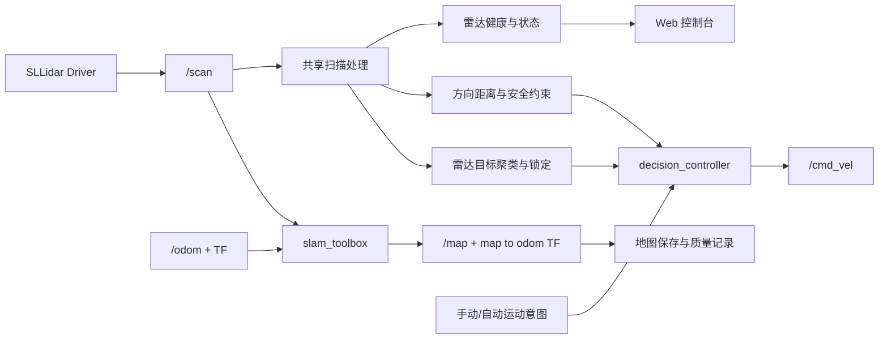

# 雷达模块阶段一至阶段五设计开发文档

## 1. 文档信息

| 项目 | 内容 |
| --- | --- |
| 文档状态 | Proposed（待评审） |
| 适用项目 | 进阶式挑战性综合项目 II：机器人系统设计与实现 |
| 适用仓库 | `ros2-smart-car` |
| 主要读者 | 雷达模块开发者、开发 Agent、测试人员、项目报告撰写者 |
| 基线日期 | 2026-06-20 |
| 需求来源 | `进阶式挑战性综合项目II课题任务书.docx`、当前仓库代码与 README |

本文档定义雷达模块阶段一至阶段五的设计思路、实现方法、接口、边界、开发任务、验收条件和报告证据。它是开发前的设计基线，不代表其中尚未实现的功能已经完成。

当前设计已依据本地任务书和仓库基线核对。由于在线 ROS 官方文档访问在本次编写时返回 HTTP 403，实施 Agent 在引入 `slam_toolbox`、`nav2_map_server` 或具体 launch 文件前，必须在目标 ROS 2 Humble 环境通过已安装包清单、包内 launch 文件和官方文档再次确认接口，不得仅凭本文档猜测命令名称。

## 2. 需求与现状

### 2.1 任务书中的客观要求

任务书明确要求：

1. 完成激光雷达基本功能并作为机器人感知模块。
2. 获取和处理激光雷达数据。
3. 实现雷达避障。
4. 实现雷达追踪。
5. 实现建图。
6. 使机器人感知部分能够正常运行与输出。
7. 在 ROS 2 环境中完成系统开发，并考虑树莓派 5 与 Docker 部署。

任务书没有定义雷达追踪对象、建图算法、地图质量和避障效果的量化指标。因此，本文档给出可执行的工程定义，并将需要指导教师确认的内容列为开放问题。

### 2.2 当前仓库事实

| 能力 | 当前状态 | 主要依据 |
| --- | --- | --- |
| `/scan` 数据接入 | 已实现 | `bringup_all.launch.py` 启动 SLLidar 驱动 |
| 前方距离 | 已实现 | 180° 车头中心、左右各 35°、20% 低分位 |
| 停车与减速 | 已实现 | 0.45 m 停车、0.75 m 减速 |
| 自动模式雷达超时停车 | 已实现 | 0.6 s 无新扫描时停车 |
| Web 点云 | 已实现 | 最多抽取 96 个有效点并旋转显示 |
| 辅助障碍节点一致性 | 未完成 | 仍以 0° 为车头并取单点最小值 |
| 全向避障 | 未完成 | 仅计算前方距离 |
| SLAM 建图 | 未完成 | 只有 `mapping` 模式占位 |
| 地图保存、加载和质量评估 | 未完成 | 仓库没有对应实现 |
| 自研雷达追踪 | 未完成 | 仅保留厂商示例启动命令 |

## 3. 设计目标与边界

### 3.1 总体目标

建立一条可验证的二维雷达能力链：

```text
稳定扫描 → 健康监控 → 全向安全 → 二维建图 → 地图交付 → 几何目标追踪
```

完成后，系统应能回答以下问题：

- 雷达是否在线，数据是否新鲜且有效。
- 小车计划运动的方向是否存在碰撞风险。
- 小车能否通过遥控完成二维环境建图并保存地图。
- 小车能否基于雷达点簇稳定跟随近距离几何目标。

### 3.2 关键设计原则

1. **安全优先**：急停和雷达安全约束高于建图、追踪与其他运动意图。
2. **单一安全仲裁点**：只有 `decision_controller` 负责输出本项目的最终 `/cmd_vel`。
3. **算法一致性**：距离统计、坐标方向和有效点过滤使用共享纯函数，不允许各节点各写一套。
4. **失效安全**：自主模式下雷达过期、TF 缺失或目标丢失时输出零速度。
5. **先离线后实车**：先用纯函数测试和 rosbag 回放，再进行低速实车验证。
6. **厂商边界清晰**：SLLidar、底盘驱动和厂商示例属于外部依赖；本项目自研部分是处理、仲裁、建图集成、追踪策略、状态与测试。
7. **证据驱动**：每个阶段必须保存命令输出、参数、截图或数据记录，供报告引用。

### 3.3 明确边界

#### 本文档范围内

- 二维 `sensor_msgs/LaserScan` 数据处理。
- 雷达健康监控和 Web 状态输出。
- 麦克纳姆底盘方向相关安全约束。
- ROS 2 Humble 下的二维 SLAM 集成。
- 地图保存、加载、质量检查和展示。
- 基于点簇几何连续性的目标跟随。

#### 本文档范围外

- 三维点云建图和视觉—雷达融合 SLAM。
- 雷达对“人”的语义识别或身份识别。
- Nav2 全局规划和自主目标点导航。
- 室外大范围定位、GPS 融合和多机器人建图。
- 修改厂商驱动内部协议，除非实测证明驱动本身存在阻塞问题。

## 4. 总体架构



### 4.1 坐标约定

- 所有安全计算以 `base_link` 的运动方向语义为准：`+x` 前、`+y` 左、`+z` 上。
- 原始雷达坐标由 TF 描述，算法不得通过散落的常量重复修正安装角。
- 在过渡阶段可保留 `front_center_deg=180`，但阶段三前应建立正确的 `base_link → laser` 静态 TF，并逐步把安装补偿移入 TF。
- Web 点云只负责显示；安全判断必须使用未经显示降采样的完整有效扫描。

### 4.2 主题与状态接口

| 接口 | 类型 | 生产者 | 消费者 | 说明 |
| --- | --- | --- | --- | --- |
| `/scan` | `sensor_msgs/LaserScan` | SLLidar | 安全、状态、SLAM、追踪 | 原始扫描 |
| `/obstacle/front` | `std_msgs/Bool` | 障碍监控 | 调试/兼容 | 不作为唯一安全来源 |
| `/robot/status` | `std_msgs/String` JSON | 状态节点 | Web 后端 | 增加雷达健康和方向距离 |
| `/map` | `nav_msgs/OccupancyGrid` | slam_toolbox | RViz/Web/保存 | 二维占据栅格 |
| `/lidar/target` | `geometry_msgs/PointStamped` | 雷达追踪节点 | 决策、状态 | 目标在 `base_link` 下的位置 |
| `/lidar/target_valid` | `std_msgs/Bool` | 雷达追踪节点 | 决策、状态 | 目标有效性 |
| `/cmd_vel` | `geometry_msgs/Twist` | 决策控制器 | 底盘驱动 | 最终运动命令 |

建议在 `/robot/status` 中增加以下字段：

```json
{
  "lidar": {
    "ok": true,
    "scan_age_sec": 0.08,
    "scan_rate_hz": 9.6,
    "valid_ratio": 0.74,
    "message": "ok"
  },
  "distances": {
    "front": 1.24,
    "rear": 2.11,
    "left": 0.86,
    "right": 1.43,
    "surround_min": 0.62
  }
}
```

## 5. 阶段一：雷达处理一致性与健康监控

### 5.1 目标

消除当前三套雷达处理逻辑的不一致，使系统能够可靠判断雷达是否在线、数据是否新鲜、扫描是否可用。

### 5.2 设计思路

共享纯函数负责：

- 角度归一化和扇区选择。
- `NaN`、无穷值和量程外数据过滤。
- 分位距离或后续聚类距离计算。
- 有效点比例计算。
- 点云投影。

ROS 节点只负责订阅、计时、参数加载和消息发布。`laser_obstacle_monitor`、`decision_controller`、`system_status_node` 对同一帧扫描必须得到相同前方距离。

健康状态使用单调时钟计算数据年龄，使用滑动窗口估计频率。Web 不得再以“点云数组非空”作为雷达实时在线的充分条件。

### 5.3 实现任务

- [ ] 扩展共享扫描处理模块，返回距离、有效点数和有效比例。
- [ ] 为 `laser_obstacle_monitor` 增加 `front_center_deg` 和 `front_distance_percentile`。
- [ ] 删除该节点对固定 0° `min_front_range()` 的依赖。
- [ ] 在状态节点维护最后扫描时间和滑动频率窗口。
- [ ] 在 `/robot/status` 增加 `lidar` 健康对象。
- [ ] 更新 Web 发车检查和状态卡片。
- [ ] 增加相同扫描在三个消费者中结果一致的回归测试。

### 5.4 参数初值

| 参数 | 初值 | 说明 |
| --- | ---: | --- |
| `front_center_deg` | 180° | 过渡期安装方向补偿 |
| `front_angle_deg` | 35° | 前方半扇区宽度 |
| `front_distance_percentile` | 20% | 抗孤立近点噪声 |
| `scan_timeout_sec` | 0.6 s | 自主运动失效安全阈值 |
| `health_window_size` | 20 帧 | 频率估计窗口 |
| `min_valid_ratio` | 0.05 | 低于此值判定扫描异常的初始阈值 |

这些数值是现有配置或工程初值，必须通过实车数据确认，不应在报告中描述为理论最优值。

### 5.5 验收条件

- 同一 `LaserScan` 输入下，三个节点的前方距离误差为 0。
- 雷达停止发布后 0.6 s 内，`lidar.ok=false`。
- 自动、颜色跟踪和目标跟随模式在雷达过期后输出零速度。
- Web 明确显示“正常、过期、有效点不足、未收到数据”四类状态。
- 单元测试和前端构建全部通过。

### 5.6 报告证据

- 雷达健康状态 JSON 截图。
- `/scan` 实测频率记录。
- 雷达断开前后的状态对比。
- 三节点算法统一前后的结构图。

## 6. 阶段二：全向安全扇区与方向相关避障

### 6.1 目标

让前进、后退、横移和旋转分别受到对应方向的障碍约束，解决单一前方距离无法保护麦克纳姆底盘的问题。

### 6.2 设计思路

将完整扫描划分为前、后、左、右四个安全扇区，同时计算车身周围最小安全距离。安全层先根据期望 `Twist` 判断运动方向，再选择需要检查的扇区：

| 运动意图 | 检查扇区 | 处理原则 |
| --- | --- | --- |
| `linear.x > 0` | 前方 | 停车或减速 |
| `linear.x < 0` | 后方 | 停车或减速 |
| `linear.y > 0` | 左侧 | 停车或减速 |
| `linear.y < 0` | 右侧 | 停车或减速 |
| `angular.z != 0` | 环绕区 | 距离不足时禁止旋转 |
| 组合运动 | 所有相关扇区 | 任一危险方向触发约束 |

障碍统计采用“两级证据”：连续点簇用于普通停车判断，极近距离点用于紧急保护。这样既避免单噪点误停，也降低细杆、桌腿被 20% 分位忽略的风险。

### 6.3 建议算法

1. 将有效扫描点投影到 `base_link`。
2. 按角度与运动方向选取安全 ROI。
3. 根据相邻点欧氏距离形成连续点簇。
4. 删除小于最小点数的孤立簇。
5. 使用最近有效簇距离作为方向距离。
6. 应用停车、减速与释放迟滞，避免阈值附近抖动。

### 6.4 实现任务

- [ ] 定义四方向扇区和环绕安全区参数。
- [ ] 实现扫描点连续聚类纯函数。
- [ ] 实现方向距离结果结构。
- [ ] 将安全约束从“先判断前方”改为“先生成意图，再按方向约束”。
- [ ] 增加停车状态迟滞，避免 0.45 m 附近频繁启停。
- [ ] 在 Web 中显示四方向距离和危险方向。
- [ ] 增加前进、后退、横移、旋转和组合运动测试。

### 6.5 初始参数与标定边界

| 参数 | 建议初值 | 标定要求 |
| --- | ---: | --- |
| 停车距离 | 0.45 m | 结合车速和制动距离实测 |
| 减速距离 | 0.75 m | 保证进入停车区前已经降速 |
| 解除停车距离 | 0.52 m | 提供约 7 cm 迟滞 |
| 聚类相邻距离 | 0.12 m | 根据雷达角分辨率调整 |
| 最小簇点数 | 2～3 点 | 兼顾细障碍与噪声 |
| 旋转环绕距离 | 0.40 m | 根据车体外接圆标定 |

### 6.6 验收条件

- 四个基本运动方向均可被相应侧障碍阻止。
- 前方障碍不应阻止安全后退，除非后方或环绕区也危险。
- 单个孤立异常点不会持续触发停车。
- 细杆或桌腿形成连续有效点时能够触发停车。
- 阈值附近不会出现高频启停振荡。
- 急停始终高于方向避障，方向避障始终高于运动意图。

### 6.7 报告证据

- 四方向扇区示意图。
- 不同运动方向的障碍测试表。
- 原始最小值、低分位和点簇算法对比。
- 停车距离实测均值、最大值和最小值。

## 7. 阶段三：二维 SLAM 建图闭环

### 7.1 目标

在 ROS 2 Humble 中使用激光雷达、里程计和 TF 建立可重复运行的二维建图链路，并允许操作者低速遥控完成环境扫描。

### 7.2 技术选择

默认选择 `slam_toolbox`：

- 与 ROS 2 Humble 的二维建图场景匹配。
- 直接消费 `/scan`、里程计和 TF。
- 支持在线建图、地图序列化和后续定位扩展。

Cartographer 可作为备选，但本阶段不同时维护两套 SLAM，避免参数和测试范围翻倍。

### 7.3 前置条件

- `/scan` 时间戳和帧名正确。
- `/odom` 连续发布，单位和方向正确。
- TF 链完整：`odom → base_link → laser`。
- 系统时间一致，没有明显倒退或跨设备偏差。
- 低速直行和原地旋转时里程计方向正确。

### 7.4 命令所有权设计

建图需要人工驾驶，但当前 `mapping` 模式会输出零速度。为保持单一 `/cmd_vel` 发布者，设计为：

1. Web/TCP 继续发送 `/manual_cmd`。
2. `decision_controller` 在 `mapping` 模式下接受新鲜手动命令。
3. 雷达安全层仍对命令进行约束。
4. slam_toolbox 只负责建图，不发布底盘速度。
5. Web 后端允许 `mapping` 模式发送手动命令，但明确标记为“建图遥控”。

不建议让厂商建图遥控、Web 和决策节点同时发布 `/cmd_vel`。

### 7.5 实现任务

- [ ] 检查并记录 `/scan`、`/odom` 和 TF 树。
- [ ] 建立 `base_link → laser` 静态 TF 或修正厂商 URDF。
- [ ] 增加 slam_toolbox 参数文件。
- [ ] 创建 `mapping.launch.py`，支持是否启动底盘和雷达驱动的参数。
- [ ] 扩展 `mapping` 模式的安全遥控语义。
- [ ] 增加 SLAM 节点、TF 和 `/map` 健康状态。
- [ ] 在 RViz2 中完成小范围闭环建图。
- [ ] 使用 rosbag 记录至少一组建图数据。

### 7.6 验收条件

- `/map` 持续发布，TF 中存在 `map → odom`。
- 小车静止时地图不持续明显漂移。
- 直线墙体没有无法解释的多层重影。
- 绕行闭环后起点区域能够基本重合。
- 建图过程中雷达过期或急停时小车停止。
- 同一 rosbag 可重复生成结构相近的地图。

### 7.7 报告证据

- TF 树图和节点图。
- RViz2 建图过程截图。
- 场地实景与地图对照图。
- slam_toolbox 关键参数表。
- 闭环前后地图误差现象分析。

## 8. 阶段四：地图保存、加载与质量评估

### 8.1 目标

将“屏幕上出现地图”提升为可保存、可复现、可比较和可用于后续导航的正式成果。

### 8.2 地图资产设计

每份地图保存为独立目录：

```text
maps/<map_id>/
├─ map.yaml
├─ map.pgm
├─ metadata.json
├─ preview.png
└─ notes.md
```

`metadata.json` 至少记录：

- 地图 ID、场地名称和创建时间。
- 地图分辨率和尺寸。
- 雷达、里程计和 SLAM 参数版本。
- Git commit。
- 建图人员、运行平台和 rosbag 路径。
- 已知缺陷和验收结论。

### 8.3 质量指标

| 指标 | 计算或检查方法 | 目的 |
| --- | --- | --- |
| 完整性 | 目标区域是否全部覆盖 | 防止缺失房间或通道 |
| 墙体连续性 | 检查断裂和空洞 | 判断扫描与匹配稳定性 |
| 重影程度 | 同一墙体多层边缘间距 | 判断 TF、里程计或回环问题 |
| 闭环一致性 | 回到起点后的轮廓偏差 | 判断累计漂移 |
| 可重复性 | 同场地多次地图对比 | 排除偶然成功 |
| 可加载性 | 地图服务重新加载 | 为后续定位和导航准备 |

### 8.4 实现任务

- [ ] 增加地图输出目录和命名规范。
- [ ] 封装 `map_saver_cli` 保存命令或脚本。
- [ ] 自动生成 `metadata.json`。
- [ ] 增加地图加载启动文件。
- [ ] 在 Web 或文档中提供地图预览。
- [ ] 建立地图验收记录模板。
- [ ] 在同一场地至少完成两次独立建图并比较。

### 8.5 验收条件

- 地图可保存为合法的 `.yaml + .pgm`。
- 重启系统后能够重新加载并在 RViz2 显示。
- 地图目录包含参数、commit 和测试说明。
- 同一场地至少两次建图结果结构一致，没有严重拓扑差异。
- 报告可以追溯每张地图对应的代码、参数和实测过程。

### 8.6 报告证据

- 地图资产目录截图。
- 地图保存和重新加载命令输出。
- 两次地图对比图。
- 地图质量问题、原因和参数调整记录。

## 9. 阶段五：雷达几何目标追踪

### 9.1 目标与术语边界

实现基于二维激光点簇的近距离目标检测、锁定和跟随。该功能称为“雷达几何目标追踪”，不声称能够仅凭二维雷达确认目标一定是人。

如果课程要求“人物追踪”，必须增加视觉语义确认或由操作者完成初始目标指定；单纯点簇尺寸只能提供启发式判断。

### 9.2 算法流程

```text
/scan
  → 有效点过滤
  → 转换到 base_link
  → 前方追踪 ROI
  → 相邻点欧氏聚类
  → 候选簇尺寸与距离过滤
  → 初始目标选择
  → 跨帧最近邻锁定
  → 目标位置与有效性发布
  → decision_controller 计算跟随速度
```

### 9.3 目标选择与锁定

- 初始目标：优先选择 ROI 中距离适中、簇宽合理且靠近正前方的候选簇。
- 连续目标：选择与上一帧预测位置最近且跳变量小于阈值的点簇。
- 短时丢失：不发布虚假位置，控制器立即停止前进，可短时保留内部锁定 ID。
- 超时重选：超过锁定超时后清除目标，等待新候选。
- 多目标交叉：不承诺基于二维几何特征保持身份，只保证尽量保持位置连续性。

### 9.4 控制方法

设目标在 `base_link` 中的位置为 `(x, y)`：

```text
distance = sqrt(x² + y²)
bearing  = atan2(y, x)
linear.x = clamp(k_distance × (distance - desired_distance))
angular.z = clamp(k_bearing × bearing)
```

控制约束：

- 距离误差位于死区时 `linear.x=0`。
- 角度偏差过大时优先转向并降低前进速度。
- 雷达安全层在控制输出之后再次约束速度。
- 目标数据过期、候选跳变过大或雷达异常时立即停车。
- 初期不启用自动倒车追踪，避免后方安全能力不足时产生风险。

### 9.5 建议初始参数

| 参数 | 建议初值 | 边界 |
| --- | ---: | --- |
| 追踪 ROI | ±60°、0.3～2.5 m | 不处理背后目标 |
| 聚类相邻距离 | 0.12 m | 随距离和角分辨率标定 |
| 最小簇点数 | 3 | 防止孤立噪声 |
| 目标期望距离 | 0.8 m | 必须大于停车距离 |
| 目标丢失超时 | 0.4 s | 超时前也不继续盲目前进 |
| 最大线速度 | 0.15 m/s | 初期低速验证 |
| 最大角速度 | 0.8 rad/s | 防止快速摆动 |
| 最大目标跳变 | 0.35 m/帧 | 需要结合扫描频率调整 |

### 9.6 ROS 2 设计

- 新增 `lidar_tracker_node`，只负责检测和锁定，不直接发布 `/cmd_vel`。
- 新增模式 `lidar_follow`，与视觉 `object_follow` 明确区分。
- 发布 `/lidar/target` 和 `/lidar/target_valid`。
- `decision_controller` 订阅目标并应用超时和安全仲裁。
- `system_status_node` 输出目标位置、距离、角度、锁定时间和丢失原因。

### 9.7 实现任务

- [ ] 实现扫描点聚类纯函数及测试。
- [ ] 实现候选簇尺寸和 ROI 过滤。
- [ ] 实现跨帧目标锁定和丢失状态机。
- [ ] 新增雷达追踪 ROS 2 节点和配置。
- [ ] 新增 `lidar_follow` 模式与控制策略。
- [ ] 增加 Web 目标状态和模式入口。
- [ ] 使用录包测试静止目标、横向移动、遮挡和多目标场景。
- [ ] 通过低速实车测试验证跟随与安全停车。

### 9.8 验收条件

- 单目标在 ROI 内移动时，目标位置连续且无频繁跳变。
- 目标丢失后小车在控制周期内停止前进。
- 目标距离小于安全停车距离时跟随命令被覆盖。
- 非 ROI 点、孤立噪声和过小点簇不会成为目标。
- 多目标场景发生换目标时，状态中能够记录锁定重置，而不是静默跳变。
- 报告明确说明这是几何目标追踪，不将其描述为语义人物识别。

### 9.9 报告证据

- 聚类和目标锁定示意图。
- 目标距离、方位角和速度随时间曲线。
- 单目标、多目标、遮挡和丢失测试表。
- 安全层覆盖追踪命令的日志或曲线。

## 10. Agent 开发执行规范

### 10.1 实施顺序

Agent 必须按阶段依赖顺序执行：阶段一通过后才能进入阶段二；阶段二通过后才能进行阶段三和阶段五实车运动；阶段三通过后才能进入阶段四。

### 10.2 每个任务的固定流程

1. 阅读本文档对应阶段、当前实现和相关测试。
2. 列出假设和本任务不处理的范围。
3. 先增加失败测试或可重复的 rosbag 验证。
4. 优先实现不依赖 ROS 的纯函数。
5. 接入 ROS 节点和配置。
6. 运行聚焦测试，再运行全量测试和前端构建。
7. 在 `stop` 模式或架空车轮条件下完成接口检查。
8. 经人工确认后进行低速实车验证。
9. 更新 README、测试记录和本文档的状态。

### 10.3 常用验证命令

```bash
PYTHONPATH=ros2_ws/src/smart_car_decision python -m pytest -q

cd web-console
node --experimental-strip-types --test --test-isolation=none \
  tests/colorPersistence.test.ts tests/robotApi.test.ts tests/videoState.test.ts
npm run build

ros2 topic hz /scan
ros2 topic echo /scan --once
ros2 topic echo /robot/status
ros2 topic echo /cmd_vel
ros2 run tf2_tools view_frames
ros2 topic echo /map --once
```

### 10.4 Agent 行为边界

#### 始终执行

- 保留急停最高优先级。
- 对传感器消息做时间戳、范围和有限值检查。
- 为新增纯逻辑添加单元测试。
- 将参数放入 YAML，不把实车参数散落在代码中。
- 记录实测环境、commit、参数和结果。

#### 修改前必须确认

- 更换 SLAM 框架。
- 新增 ROS 自定义消息包或大型依赖。
- 修改底盘厂商驱动、串口协议或 URDF 主体结构。
- 允许多个节点直接发布 `/cmd_vel`。
- 将雷达追踪描述为人物语义识别。

#### 禁止执行

- 在无雷达或数据过期时继续自主前进。
- 删除失败测试来使构建通过。
- 把厂商示例结果写成自研成果。
- 未经人工安全确认直接启动实车高速运动。
- 用 Web 降采样点云替代完整扫描进行安全判断。

## 11. 测试矩阵

| 层级 | 工具 | 覆盖内容 | 阶段门槛 |
| --- | --- | --- | --- |
| 纯函数测试 | pytest | 扇区、过滤、聚类、锁定、控制 | 每次提交 |
| 节点测试 | ROS 2 topic/launch | 参数、话题、超时、状态 | 每阶段 |
| 离线回放 | rosbag2 | 噪声、建图、追踪复现 | 阶段二后 |
| 可视化检查 | RViz2/Web | TF、点云、地图、目标 | 阶段三后 |
| 实车测试 | 低速场地 | 停车、建图、追踪 | 人工安全门后 |
| 长时间测试 | 30～60 分钟 | 频率、内存、断连恢复 | 最终验收 |

## 12. 最终报告撰写映射

| 报告章节 | 可直接使用的本文档内容 | 必须补充的实测证据 |
| --- | --- | --- |
| 需求分析 | 第 2、3 节 | 任务书原文引用和团队分工 |
| 总体设计 | 第 4 节 | 最终节点图和部署图 |
| 详细设计 | 第 5～9 节 | 最终参数、类图或流程图 |
| 系统实现 | 各阶段“实现任务” | 实际代码文件和界面截图 |
| 测试设计 | 第 11 节 | 测试数据、日志和结果表 |
| 创新点 | 一致性处理、方向安全、可追溯地图、几何锁定 | 与原厂示例的边界对比 |
| 不足与展望 | 各阶段边界 | 失败案例和改进方向 |

报告必须使用以下状态词：

- **已设计**：已有本文档，但代码尚未完成。
- **已实现**：代码和自动化测试完成。
- **已验证**：在指定硬件和场地完成实测并留存证据。
- **未完成**：尚未达到验收条件。

不得使用“计划实现”内容冒充“已验证”结果。

## 13. 风险与缓解措施

| 风险 | 影响 | 缓解措施 |
| --- | --- | --- |
| 里程计漂移或方向错误 | 地图重影、闭环失败 | 先验证直线、旋转和 TF，再调 SLAM |
| 雷达时间戳或 TF 错误 | 地图扭曲 | 检查时钟、frame_id 和 TF 延迟 |
| 低分位忽略细障碍 | 漏检 | 引入连续点簇和极近距离保护 |
| 多节点争抢 `/cmd_vel` | 运动不可预测 | 保持决策控制器为唯一仲裁点 |
| 二维雷达无法识别人 | 追踪对象语义不可靠 | 明确几何边界，必要时与视觉融合 |
| Jetson 与树莓派 5 差异 | 部署不符合任务书 | 分离硬件配置，补做树莓派与 Docker 验收 |
| 参数只适用于单一场地 | 泛化不足 | 保存参数版本并进行多场景测试 |

## 14. 开放问题

以下问题需要在阶段五前由团队或指导教师确认：

1. “雷达追踪”验收对象是一般几何目标、人员还是指定反光目标。
2. 建图是否必须运行在树莓派 5，Jetson 是否允许作为替代计算平台。
3. 最终验收是否要求 Docker 内直接访问雷达和底盘串口。
4. 建图场地面积、地图分辨率和允许误差是否有统一标准。
5. 雷达追踪是否允许视觉提供初始目标语义确认。
6. 阶段五是否要求目标丢失后的搜索行为；本文档默认仅停车，不自动搜索。

在这些问题确认前，开发应遵循本文档的保守默认值，不扩大安全风险和功能表述。
