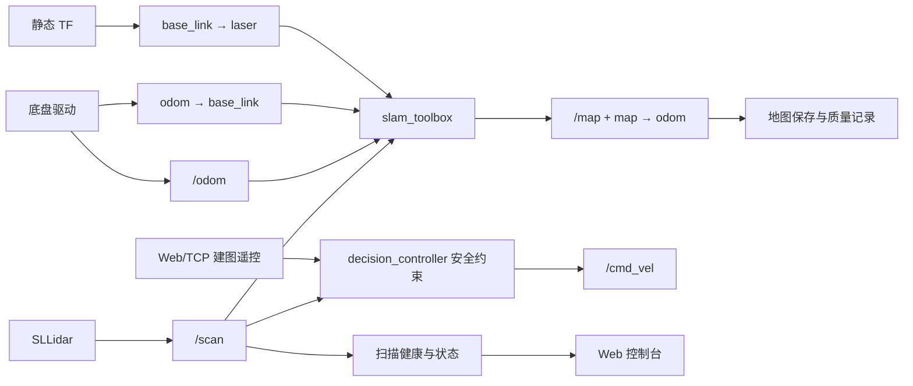

# 雷达扫描与二维建图设计开发文档

## 1. 文档定位

| 项目 | 内容 |
| --- | --- |
| 文档状态 | **Implemented（本地验证完成，待 Jetson 实车验收）** |
| 适用项目 | **进阶式挑战性综合项目 II：机器人系统设计与实现** |
| 开发范围 | **激光雷达扫描、二维 SLAM 建图、地图保存与验收** |
| 已有能力 | **人物追踪、颜色追踪、基础雷达避障与 Web 点云** |
| 主要读者 | 开发 Agent、雷达模块开发者、测试人员、最终报告撰写者 |
| 基线日期 | 2026-06-21 |

本文档只指导**扫描和建图**开发。**人物追踪和颜色追踪已经完成**，本轮只做回归验证，不再安排算法开发。文档中的“已设计”“已实现”“已验证”必须严格区分，尚未实车测试的内容不能写成已验证。

### 1.1 实现状态

| 交付项 | 代码状态 | 验证状态 |
| --- | --- | --- |
| 扫描质量与健康状态 | 已实现 | 自动化测试通过，待 Jetson 断连/恢复实测 |
| Web 雷达健康显示 | 已实现 | 前端测试和生产构建通过 |
| mapping 安全遥控 | 已实现 | 控制策略测试通过，待低速实车验证 |
| 建图前置检查与 rosbag2 工具 | 已实现 | Shell 语法通过，待 Jetson 执行 |
| slam_toolbox 配置与 mapping launch | 已实现 | 静态配置和语法通过，待 Jetson 建图 |
| 地图保存、加载与质量报告 | 已实现 | PGM/YAML 自动化测试通过，待真实地图验收 |

## 2. 需求、现状与边界

### 2.1 本轮目标

1. 稳定获取、校验和监控 **`/scan`**。
2. 完善雷达扫描处理、状态输出和 Web 可视化。
3. 验证建图所需的 **`/odom`、TF 和时间戳链路**。
4. 接入 **ROS 2 Humble + `slam_toolbox`**，形成可操作的二维建图模式。
5. 保存、重新加载并评估地图，形成最终报告证据。

### 2.2 当前完成情况

| 能力 | 当前状态 | 本轮处理 |
| --- | --- | --- |
| 人物追踪 | 已完成 | 仅回归验证 |
| 颜色追踪 | 已完成 | 仅回归验证 |
| SLLidar 驱动启动 | 已实现 | 补充健康诊断 |
| `/scan` 数据获取 | 已实现 | 增加频率、数据年龄、有效率 |
| 前方距离与安全停车 | 已实现 | 统一辅助节点算法 |
| Web 雷达点云 | 已实现 | 增加新鲜度和异常状态 |
| `/odom` | 依赖厂商底盘 | 验证方向、频率和漂移 |
| TF 链 | 未完成建图验收 | 补齐并验证 |
| `mapping` 模式 | 仅占位 | 接入安全遥控 |
| SLAM 与 `/map` | 未实现 | 本轮核心任务 |
| 地图保存、加载、评估 | 未实现 | 本轮核心任务 |

### 2.3 范围外内容

- 人物追踪、颜色追踪的新功能或重构。
- 雷达点簇目标追踪。
- **Nav2** 定位、目标点导航和路径规划。
- 三维点云、视觉—雷达融合 SLAM、多机器人建图。
- 机械臂抓取和厂商驱动内部协议修改。
- 将厂商驱动、厂商示例或 `slam_toolbox` 算法描述为完全自研。

## 3. 总体设计

### 3.1 设计原则

1. **扫描先可信，建图后开展**：未证明 `/scan`、`/odom` 和 TF 正确前，不调 SLAM 参数。
2. **安全链路不旁路**：建图遥控仍通过 `decision_controller`，不新增第二个 `/cmd_vel` 发布者。
3. **坐标关系由 TF 表达**：显示旋转和安全扇区参数不能代替 TF。
4. **失效安全**：建图期间雷达过期、急停或手动命令过期时停车。
5. **参数配置化**：硬件和 SLAM 参数写入 YAML/launch。
6. **证据可追溯**：地图关联 Git commit、配置、场地、平台和测试记录。
7. **既有能力稳定**：人物追踪和颜色追踪接口保持兼容。

### 3.2 数据流



### 3.3 坐标系与接口

建图必须形成：

```text
map → odom → base_link → laser
```

| 接口 | 类型 | 作用 | 验收重点 |
| --- | --- | --- | --- |
| `/scan` | `sensor_msgs/LaserScan` | 原始雷达扫描 | 频率、时间戳、frame、有效率 |
| `/odom` | `nav_msgs/Odometry` | 底盘里程计 | 方向、连续性、漂移 |
| `/tf`、`/tf_static` | `tf2_msgs/TFMessage` | 坐标变换 | 链路完整、无重复发布 |
| `/map` | `nav_msgs/OccupancyGrid` | 二维占据栅格 | 更新频率、分辨率、frame |
| `/robot/status` | `std_msgs/String` JSON | Web 状态 | 雷达健康与扫描年龄 |
| `/manual_cmd` | `std_msgs/String` | 建图遥控意图 | mapping 模式可用 |
| `/cmd_vel` | `geometry_msgs/Twist` | 最终底盘命令 | 仅决策控制器发布 |

当前安全计算用 **`front_center_deg=180`** 补偿雷达安装方向。建图必须通过 **`base_link → laser` TF** 表达真实安装位姿。安全算法暂时不经过 TF，因此可保留 180° 参数；不得在同一处理链中重复旋转。

## 4. 阶段一：扫描接入与健康监控

### 4.1 设计思路

建立共享扫描处理逻辑，统一完成：

- 过滤 `NaN`、无穷值和量程外数据。
- 计算总点数、有效点数和有效比例。
- 计算配置扇区距离。
- 使用单调时钟计算数据年龄。
- 使用滑动窗口估计扫描频率。
- 完整扫描用于安全与 SLAM，降采样点只用于 Web。

建议扩展状态：

```json
{
  "lidar": {
    "ok": true,
    "message": "ok",
    "scan_age_sec": 0.08,
    "scan_rate_hz": 9.6,
    "valid_count": 723,
    "valid_ratio": 0.74,
    "frame_id": "laser"
  }
}
```

### 4.2 开发任务

- [ ] 增加扫描质量统计纯函数及单元测试。
- [ ] 统一 `decision_controller`、`system_status_node`、`laser_obstacle_monitor` 的方向、扇区和分位参数。
- [ ] 为辅助节点增加 `front_center_deg` 和 `front_distance_percentile`。
- [ ] 状态节点增加扫描时间、频率、有效率和 `frame_id`。
- [ ] Web 发车检查读取 `lidar.ok`，不再仅检查点云是否非空。
- [ ] 增加未启动、过期、有效点不足和恢复正常测试。

### 4.3 参数初值

| 参数 | 初值 | 说明 |
| --- | ---: | --- |
| `front_center_deg` | 180° | 当前实车安装补偿 |
| `front_angle_deg` | 35° | 前方半扇区 |
| `front_distance_percentile` | 20% | 抑制孤立近点噪声 |
| `scan_timeout_sec` | 0.6 s | 失效安全阈值 |
| `health_window_size` | 20 帧 | 频率估计窗口 |
| `min_valid_ratio` | 0.05 | 初值，需实测标定 |

### 4.4 验收与报告证据

- 同一 `LaserScan` 输入下，三个节点得到相同前方距离。
- 雷达停止发布后 0.6 s 内 `lidar.ok=false`。
- 扫描恢复后状态自动恢复。
- Web 显示频率、数据年龄和异常原因。
- 保存 `/scan` 频率、单帧消息、断开/恢复截图和有效率统计。
- 人物追踪、颜色追踪及现有控制测试不回归。

## 5. 阶段二：扫描处理与可视化完善

### 5.1 实现方法

- Web 点云最多输出约 96 个有效点，避免 JSON 过大。
- 原始 `/scan` 不因 Web 降采样而改变。
- Web、RViz2 与真实车头方向必须一致。
- 使用 **rosbag2** 保存空旷、墙面、桌腿和动态人员场景。
- 回放录包验证过滤、方向和前方距离的可重复性。

### 5.2 开发任务

- [ ] 验证 Web 点云旋转与真实车头一致。
- [ ] 增加点云上限、空扫描和异常量程测试。
- [ ] 增加 RViz2 雷达检查配置或操作说明。
- [ ] 增加 rosbag2 录制与回放脚本。
- [ ] 记录四类典型扫描场景。
- [ ] 补充频率下降和大量 `inf` 的异常测试。

### 5.3 验收与报告证据

- 实际车头障碍在 Web 和 RViz2 中方向一致。
- Web 点数受控，原始扫描保持完整。
- 空数据和异常量程不会导致节点退出。
- 至少一份 rosbag2 可离线复现扫描处理结果。
- 报告保存实景、RViz2、Web 对照图及点数统计表。

## 6. 阶段三：SLAM 前置条件验证

### 6.1 验证顺序

1. 确认 `LaserScan.header.frame_id` 与雷达 TF 子坐标系一致。
2. 检查 `odom → base_link` 持续发布且无重复发布者。
3. 根据实测安装尺寸补齐 `base_link → laser`。
4. 静止观察里程计和 TF 是否明显跳变。
5. 低速直行，确认 `odom.x` 正向增加。
6. 原地左转，确认 yaw 符号符合 ROS 坐标约定。
7. 检查消息时间戳没有倒退，TF 查询不频繁超时。

### 6.2 开发任务

- [ ] 记录 `/scan`、`/odom` 的频率、frame 和时间戳。
- [ ] 生成并检查 TF 树。
- [ ] 配置雷达平移和 yaw 静态 TF。
- [ ] 将安装参数放入 launch/YAML，不写死在算法中。
- [ ] 增加建图前检查脚本。
- [ ] 记录静止、直行和旋转测试。

### 6.3 验收与报告证据

- TF 链 `odom → base_link → laser` 连通且无重复发布。
- 直行和旋转方向符合 ROS 坐标约定。
- 静止里程计不存在影响建图的持续大幅漂移。
- 雷达时间戳能够正常查询对应 TF。
- 报告提供 TF 树、频率表、安装尺寸、直行距离和旋转角度对比。

## 7. 阶段四：二维 SLAM 建图闭环

### 7.1 技术方案

默认采用 **`slam_toolbox`**，因为它适用于 ROS 2 二维激光建图，直接使用 `/scan`、里程计和 TF，并支持地图序列化。**Cartographer** 作为备选，本阶段不同时维护两套 SLAM。

实施 Agent 必须根据目标设备实际安装版本核对包名、参数和 launch 接口。

### 7.2 建图模式控制边界

当前 `mapping` 模式直接停车，无法遥控建图。实现时：

1. Web/TCP 继续发布 `/manual_cmd`。
2. `decision_controller` 在 `mapping` 模式接受新鲜手动命令。
3. 急停、前方障碍和雷达超时继续覆盖运动命令。
4. `slam_toolbox` 不发布 `/cmd_vel`。
5. 不启动另一个会发布 `/cmd_vel` 的厂商遥控节点。

### 7.3 参数初值

| 参数 | 初值 | 说明 |
| --- | ---: | --- |
| `map_frame` | `map` | 地图坐标系 |
| `odom_frame` | `odom` | 里程计坐标系 |
| `base_frame` | `base_link` | 机器人主体坐标系 |
| `scan_topic` | `/scan` | 雷达话题 |
| `resolution` | 0.05 m | 初始栅格分辨率 |
| `map_update_interval` | 2.0 s | 地图更新周期 |
| `minimum_time_interval` | 0.2 s | 扫描匹配间隔 |
| `max_laser_range` | 不超过实测 `range_max` | 排除无效远距离 |

### 7.4 开发任务

- [x] 在 `package.xml` 声明建图运行依赖。
- [x] 新增 `slam_toolbox` 参数文件。
- [x] 创建 `mapping.launch.py`，统一启动现有 bringup 和在线异步 SLAM。
- [x] 提供默认关闭、可通过 launch 参数启用的静态雷达 TF；实际位姿留待 Jetson 标定。
- [x] 让 `mapping` 模式支持安全手动遥控。
- [x] 增加雷达扫描和 `/map` 健康状态。
- [ ] 在 RViz2 完成小范围建图。
- [ ] 使用同一 rosbag2 验证可重复启动。

### 7.5 调试与验收

1. 静止启动，确认 `/map` 和 `map → odom` 出现。
2. 低速直行，检查墙体是否拉伸。
3. 原地低速旋转，检查轮廓是否重影。
4. 沿简单矩形路线移动。
5. 返回起点，观察闭环是否重合。

### 7.6 实现依据

- **`slam_toolbox` 参数**以官方 ROS 2 Humble 示例配置为基线，再根据本车的 `base_link`、量程和更新频率调整：[`mapper_params_online_async.yaml`](https://github.com/SteveMacenski/slam_toolbox/blob/humble/config/mapper_params_online_async.yaml)。
- **建图 launch 接口**按官方 Humble `online_async_launch.py` 使用 `use_sim_time` 和 `slam_params_file` 参数：[`online_async_launch.py`](https://github.com/SteveMacenski/slam_toolbox/blob/humble/launch/online_async_launch.py)。
- **地图保存与加载**使用 Nav2 官方 `nav2_map_server`；Humble 官方 CLI 测试使用 `map_saver_cli -f <path>`：[`nav2_map_server`](https://github.com/ros-navigation/navigation2/tree/humble/nav2_map_server)。

验收要求：

- `/map` 持续发布且 frame 为 `map`。
- TF 链完整。
- 只有 `decision_controller` 发布最终 `/cmd_vel`。
- 急停或雷达过期时建图遥控停车。
- 地图无严重漂移、错层和拓扑断裂。
- 人物追踪和颜色追踪模式仍能正常切换。
- 报告保存节点图、TF 树、建图截图、场地对照和参数调整记录。

## 8. 阶段五：地图保存、加载与质量验收

### 8.1 地图资产结构

```text
maps/<map_id>/
├─ map.yaml
├─ map.pgm
├─ metadata.json
├─ preview.png
└─ notes.md
```

`metadata.json` 至少记录地图 ID、场地、时间、分辨率、尺寸、参数版本、Git commit、运行平台、ROS 2 版本、rosbag2 路径、缺陷和验收结论。

### 8.2 开发任务

- [ ] 增加 `maps/` 目录规范。
- [ ] 封装地图保存命令，生成 `.yaml + .pgm`。
- [ ] 自动生成或补充 `metadata.json`。
- [ ] 创建地图加载 launch。
- [ ] 生成地图预览图。
- [ ] 建立地图验收模板。
- [ ] 同一场地至少完成两次独立建图并比较。

### 8.3 质量指标

| 指标 | 检查方法 | 最低要求 |
| --- | --- | --- |
| 完整性 | 对照路线与房间 | 目标区域无大面积缺失 |
| 墙体连续性 | 检查断裂和空洞 | 主要墙体连续可辨 |
| 重影程度 | 检查多层边缘 | 无严重错层 |
| 闭环一致性 | 返回起点对比 | 不出现明显双地图 |
| 可重复性 | 两次独立建图 | 主要结构和拓扑一致 |
| 可加载性 | 重启加载 | YAML/PGM 正常显示 |
| 可追溯性 | 检查 metadata | 可定位代码、参数和场地 |

没有课程量化标准时，不虚构毫米级精度。报告应补充能够实际测量的墙长、走廊宽度和闭环偏差。

### 8.4 验收与报告证据

- 地图能够保存并在重启后重新加载。
- 保存失败不得覆盖已有有效地图。
- 每张正式地图均有 metadata 和测试说明。
- 两次地图主要结构一致。
- 报告提供目录截图、保存/加载输出、地图对比和尺寸误差表。

## 9. Agent 开发规范

### 9.1 固定流程

1. 阅读本文档和相关代码。
2. 明确假设、接口和不处理范围。
3. 先增加失败测试或 rosbag2 验证。
4. 优先实现纯逻辑。
5. 接入 ROS 节点、launch 和 YAML。
6. 运行聚焦测试、全量测试和前端构建。
7. 在 `stop` 模式或架空车轮条件下检查话题和 TF。
8. 人工确认安全后低速实车验证。
9. 更新本文档状态、README 和测试记录。

### 9.2 行为边界

#### 始终执行

- 保持急停最高优先级。
- 校验时间戳、范围、有限值和 frame。
- 参数写入配置文件。
- 保持人物追踪和颜色追踪接口兼容。
- 记录场地、参数、commit 和结果。

#### 修改前必须确认

- 更换 SLAM 框架。
- 修改厂商驱动、底盘协议或主体 URDF。
- 新增第二个 `/cmd_vel` 发布者。
- 改变人物追踪或颜色追踪算法。
- 进入 Nav2 或三维建图范围。

#### 禁止执行

- 雷达过期时继续建图运动。
- 用 Web 降采样点进行 SLAM 或安全判断。
- 删除失败测试来使构建通过。
- 未经人工确认高速实车建图。
- 把第三方算法和厂商示例写成完全自研。

## 10. 验证命令

### 10.1 自动化验证

```bash
PYTHONPATH=ros2_ws/src/smart_car_decision python -m pytest -q

cd web-console
node --experimental-strip-types --test --test-isolation=none \
  tests/colorPersistence.test.ts tests/robotApi.test.ts tests/videoState.test.ts
npm run build
```

### 10.2 扫描、里程计和 TF

```bash
ros2 topic hz /scan
ros2 topic echo /scan --once
ros2 topic hz /odom
ros2 topic echo /odom --once
ros2 run tf2_tools view_frames
ros2 run tf2_ros tf2_echo odom base_link
ros2 run tf2_ros tf2_echo base_link laser
```

### 10.3 建图

```bash
ros2 topic hz /map
ros2 topic echo /map --once
ros2 run tf2_ros tf2_echo map odom
ros2 node list
ros2 topic info /cmd_vel --verbose
```

具体 SLAM 和地图保存命令必须以目标 ROS 2 Humble 环境实际安装包为准。

## 11. 最终报告映射

| 报告章节 | 本文档内容 | 必须补充的证据 |
| --- | --- | --- |
| 需求分析 | 第 2 节 | 任务书原文与团队分工 |
| 总体设计 | 第 3 节 | 节点图、TF 树和部署图 |
| 详细设计 | 第 4～8 节 | 最终参数、流程图和接口 |
| 系统实现 | 各阶段开发任务 | 代码、launch 和界面截图 |
| 测试设计 | 各阶段验收、第 10 节 | 日志、rosbag2、地图和结果表 |
| 已有成果 | 人物追踪、颜色追踪、安全控制 | 回归测试和实车截图 |
| 不足与展望 | 范围边界和失败案例 | Nav2、三维感知等后续方向 |

状态词统一为：

- **已设计**：已有方案，代码未完成。
- **已实现**：代码和自动化测试完成。
- **已验证**：指定硬件与场地实测完成并留证。
- **未完成**：尚未达到验收条件。

## 12. 风险与现场确认事项

| 风险 | 影响 | 缓解措施 |
| --- | --- | --- |
| 雷达方向或 TF 错误 | 地图旋转、重影 | 对照实景、RViz2 和 Web |
| 里程计方向错误或漂移 | 地图扭曲、闭环失败 | 先做直行与旋转标定 |
| 时间戳或 TF 延迟 | 扫描无法匹配 | 检查系统时间与 TF 查询 |
| 多节点发布 `/cmd_vel` | 运动不可预测 | 保持决策控制器唯一仲裁 |
| 动态人员过多 | 地图噪声 | 选择静态场地并保存失败案例 |
| Jetson 包版本差异 | launch 或参数不兼容 | 在 Jetson 核对实际安装包和接口 |

需求口径已经确认：

1. 最终验收平台为 **Jetson**。
2. 建图场地不限定。
3. Docker 验收要求尚未确定，本轮不以 Docker 阻塞原生建图。
4. 本轮只完成扫描、建图和地图资产，不进入 Nav2 定位和导航。

Jetson 现场仍需确认：

1. 厂商 URDF 是否已经发布 `base_link → laser`，避免重复静态 TF。
2. 实际雷达 frame、安装位姿和最大有效量程。
3. `/odom` 方向、频率和漂移是否满足建图。
4. Jetson 已安装的 `slam_toolbox`、`nav2_map_server` 和 launch 接口版本。
5. 两次独立建图的闭环、重影、尺寸误差和重新加载结果。
